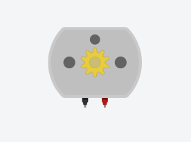

# 开源硬件课程

> 张锐-18010100420

> 2019/07/02-2019/07/05

课程内容

日期|内容|作业
---|---|---
07/02|入门介绍|创建github账号，安装arduino、fritzing、processing
07/03|arduino编程|学习Arduino编程以及各种库函数，练习morse代码
07/04|认识电子元件及操作|1、小车代码和电路图;2、数码管代码和电路图
07/05|总结|1、莫尔斯代码在tinkercad上模拟运行;2、Markdown格式学习

## 第一天 入门介绍

> 为什么要学习开源硬件

开源硬件是基于嵌入式产品平台、基于硬件描述语言、以软件开发为主的智能硬件的开发模式，为我们开发个性化嵌入式产品提供了低成本、低门槛、灵活、便捷的手段。

> 如何学习开源硬件

多**练习**，多看*原版网站*，多动手实践代码和电路

> 几个常用软件与网站

Arduino————一款便捷灵活、方便上手的开源电子原型平台。

网站————https://www.arduino.cc/
![] (img/Arduino.png)

Fritzing————电子设计自动化软件

网站————http://fritzing.org/
![] (img/Fritzing.png)

Arduino模拟网站————http://www.tinkercad.com/ 
![] (img/TinkerCAD.png)

## 第二天  Arduino编程学习

> 认识Arduino开发板

    Arduino有6个模拟输入端口，提供10-bit的解析度(0~1023)。
    有14个数字输入/输出管脚，可以自己定义为输入或者输出；
    其中0，1两个管脚是串口复用管脚；
    3，5，6，9，10，11六个管脚可提供8位（0-255）的PWM输出；
    13管脚与板上LED相连，当输出高电平时，LED点亮。

![] (img/arduino-uno.png)

> 学习morse代码
    
> 学习Arduino的各种库函数

    digitalWrite(pin,value);            //向pin端口写入高电位或者低电位
    digitalRead(pin);                   //读取pin端口的电位
    pinMode(pin,mode);                  //设置pin端口的模式——OUTPUT/INPUT

    analogRead(pin);                    //读取模拟输入端口pin的模拟值(0~1023)

    Serial.begin();                     //初始化串口并设置波特率
    Serial.available();                 //获取可从串行端口读取的字节数
    Serial.read();                      //读取传入的串行数据，返回其ASCII码
    Serial.println();                   //将数据作为ASCII文本打印到串行端口

> 作业-将串口通信中读取的字符串用morse电码模拟出来
    
    代码详情见文件夹"morse-07-03"

## 第三天 认识电子元器件

> 在在线模拟网站上连接电机电路并模拟,控制两个电机实现前进后退左转右转

> 课堂练习——在电机电路的基础上连接转向灯并修改代码

    代码和电路图见文件夹"car"

> 学习7段数码管的使用以及使用CD4211进行译码和锁码

    CD4211——连接在Arduino和7段数码管之间，起到译码和转码的作用
    其功能介绍如下： 
    BI：4脚是消隐输入控制端，当BI=0 时，不管其它输入端状态如何，七段数码管均处于熄灭状态，不显示数字。
    LT：3脚是测试输入端，当BI=1，LT=0 时，译码输出全为1，不管输入状态如何，七段均发亮，显示“8”。它主要用来检测数码管是否损坏。 
    LE：锁定控制端，当LE=0时，允许译码输出。 LE=1时译码器是锁定保持状态，译码器输出被保持在LE=0时的数值。
    A1、A2、A3、A4、为BCD码输入端。 
    a、b、c、d、e、f、g：为译码输出端

> 作业——利用串口通信，7段数码管和CD4211进行实现数字显示

    代码和电路图见文件夹"shumaguan"

## 第四天 总结

> 在在线模拟平台模拟morse代码转化

> 将第三天的数码管代码和电路拓展到4个数码管

> 学习Markdown的编写方式，用Markdown格式编写总结报告

    这四天的学习，我主要学习了Arduino的编程方法以及一些电子元器件的功能和使用方法。
    但是不得不说四天的学习果然还是太短了，我感觉还可以学很多东西的样子。
    这四天里我在老师上课内容的基础上同时又自学了很多，包括Linux系统的一些使用方法，processing软件使用等等。
    我们通院大一下学期学习的就是STM32系列的相关知识，不得不说既视感满满，不过个人觉得Arduino比STM32方便太多了，stm32则需要做相当多的配置工作，
    当然非要我选的话我可能还是会选择STM32。四天结束了，收集了很多资料，我的学习好像才刚刚开始hhh。

